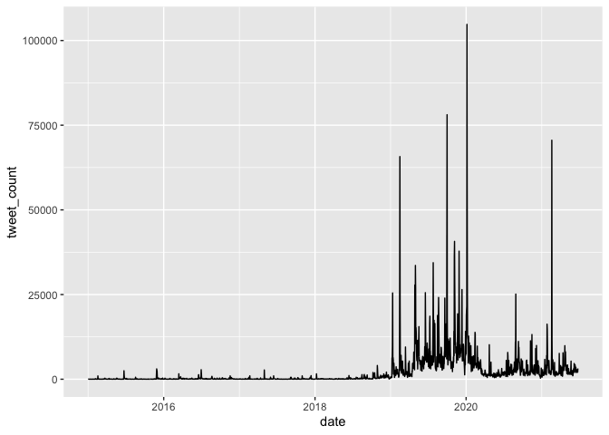
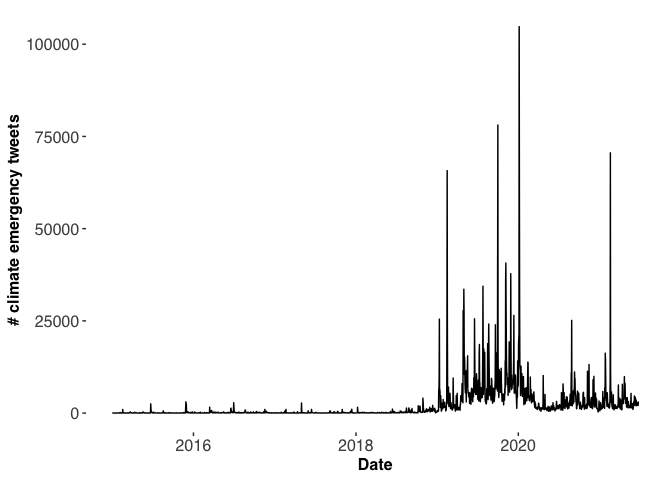
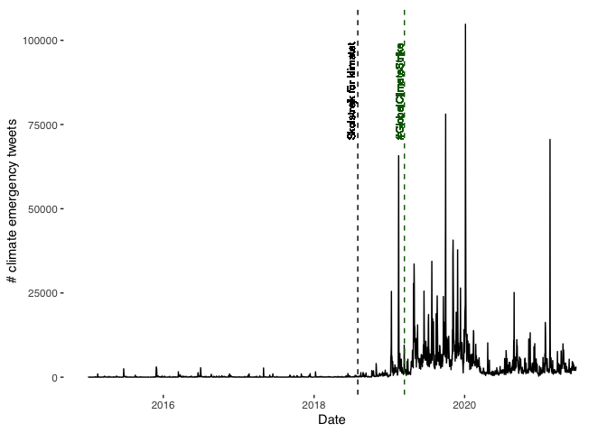
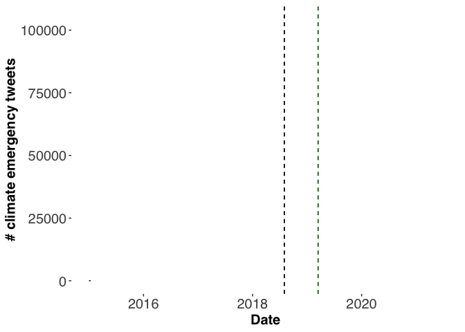
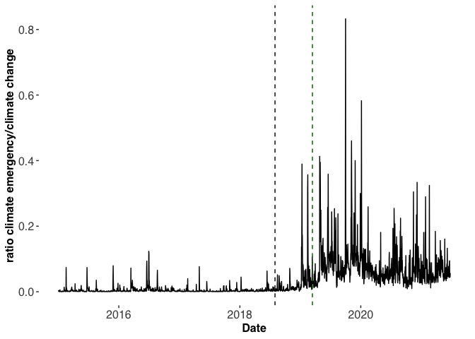

# Tweet Counts Demo

We will be using the following packages:


```r
library(academictwitteR) #to query the Twitter API
library(ggplot2) #for plotting
library(gganimate) #for plot animations
library(dplyr) #for data wrangling
library(ggthemes) #for plot styiling
library(tidyr) #for data wrangling
```


## Querying the API


```r
# main function -----------------------------------------------------------

tweetcounts <- count_all_tweets(
  query = "(climate emergency)",
  start_tweets = "2015-01-01T00:00:00Z",
  end_tweets = "2021-06-25T00:00:00Z",
  file = "data/clim_emergency.rds",
  granularity = "day",
  n = Inf
)

head(tweetcounts)
```

If you want to follow along without actually querying the API to collect the data, you can get the data from my Github here by using:


```r
tweetcounts  <- readRDS(gzcon(url("https://github.com/cjbarrie/twitter_twitch2/blob/main/data/clim_emergency.rds?raw=true")))
```

## Inspect the data


|end                      |start                    | tweet_count|
|:------------------------|:------------------------|-----------:|
|2021-05-26T00:00:00.000Z |2021-05-25T00:00:00.000Z |        1542|
|2021-05-27T00:00:00.000Z |2021-05-26T00:00:00.000Z |        2377|
|2021-05-28T00:00:00.000Z |2021-05-27T00:00:00.000Z |        1856|
|2021-05-29T00:00:00.000Z |2021-05-28T00:00:00.000Z |        2565|
|2021-05-30T00:00:00.000Z |2021-05-29T00:00:00.000Z |        1562|
|2021-05-31T00:00:00.000Z |2021-05-30T00:00:00.000Z |        1008|

## Plot

We can plot a simple line graph as so:


```r
# plot output as line graph

tweetcounts %>%
  mutate(date = as.Date(start)) %>%
  ggplot(aes(date, tweet_count)) +
  geom_line()
```

<!-- -->

And style with a few additions:


```r
# style

tweetcounts %>%
  mutate(date = as.Date(start)) %>%
  ggplot(aes(date, tweet_count)) +
  geom_line() +
  theme_tufte(base_family = "Helvetica") +
  labs(x = "Date", y = "# climate emergency tweets") +
  theme(axis.title = element_text(size = 12, face = "bold"),
        axis.text = element_text(size = 12))
```

<!-- -->

The add and label important dates:


```r
# add notable date markers

tweetcounts %>%
  mutate(date = as.Date(start)) %>%
  ggplot(aes(date, tweet_count)) +
  geom_line() +
  theme_tufte(base_family = "Helvetica") +
  labs(x = "Date", y = "# climate emergency tweets") +
  geom_vline(
    mapping = aes(xintercept = as.Date("2018-08-01")), #first Greta sit-in
    color = "black",
    linetype = "dashed"
  ) +
  geom_vline(
    mapping = aes(xintercept = as.Date("2019-03-15")), #first Global Climate Strike
    color = "darkgreen",
    linetype = "dashed"
  ) +
  geom_text(aes(x=as.Date("2018-07-01"), label="Skolstrejk för klimatet", y=85000), 
            colour="black", angle=90, size=3) +
  geom_text(aes(x=as.Date("2019-02-20"), label="#GlobalClimateStrike", y=85000), 
            colour="darkgreen", angle=90, size=3)
```

<!-- -->

And to animate:


```r
p <- tweetcounts %>%
  mutate(date = as.Date(start)) %>%
  ggplot(aes(date, tweet_count)) +
  geom_line() +
  geom_vline(
    mapping = aes(xintercept = as.Date("2018-08-01")),
    color = "black",
    linetype = "dashed"
  ) +
  geom_vline(
    mapping = aes(xintercept = as.Date("2019-03-15")),
    color = "darkgreen",
    linetype = "dashed"
  ) +
  theme_tufte(base_family = "Helvetica") +
  labs(x = "Date", y = "# climate emergency tweets") +
  transition_reveal(date) # this is the key addition

p <- p + theme(
  plot.title = element_text(size = 15),
  axis.title = element_text(size = 15, face = "bold"),
  axis.text = element_text(size = 15)
)

animate(
  p,
  fps = 10
)
```

<!-- -->

## Comparing queries

Then we make a different query:


```r
# comparing counts --------------------------------------------------------

tweetcounts2 <- count_all_tweets(
  query = "(climate change)",
  start_tweets = "2015-01-01T00:00:00Z",
  end_tweets = "2021-06-25T00:00:00Z",
  file = "data/clim_change.rds",
  granularity = "day",
  n = Inf
)
```


Again, you can get the data from my Github here by using:


```r
tweetcount2<- readRDS(gzcon(url("https://github.com/cjbarrie/twitter_twitch2/blob/main/data/clim_change.rds?raw=true")))
```

Then we can calculate the ratio of tweet counts between queries as such:


```r
tweetcountsratio <- tweetcounts %>%
  select(start, tweet_count) %>%
  rename(clim_emerg = tweet_count) %>%
  left_join(tweetcounts2, by = "start") %>%
  rename(clim_chng = tweet_count) %>%
  select(-end) %>%
  mutate(ratio = clim_emerg/clim_chng)
```

And plot:


```r
tweetcountsratio %>%
  mutate(date = as.Date(start)) %>%
  ggplot(aes(date, ratio)) +
  geom_line() +
  geom_vline(
    mapping = aes(xintercept = as.Date("2018-08-01")),
    color = "black",
    linetype = "dashed"
  ) +
  geom_vline(
    mapping = aes(xintercept = as.Date("2019-03-15")),
    color = "darkgreen",
    linetype = "dashed"
  ) +
  theme_tufte(base_family = "Helvetica") +
  labs(x = "Date", y = "ratio climate emergency/climate change") +
  theme(
  plot.title = element_text(size = 15),
  axis.title = element_text(size = 12, face = "bold"),
  axis.text = element_text(size = 12)
  )
```

<!-- -->
