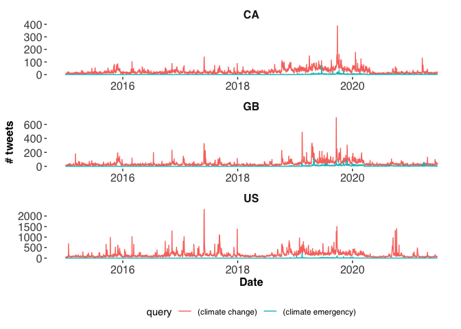
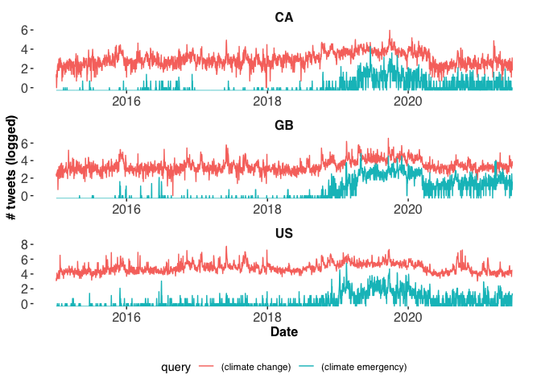
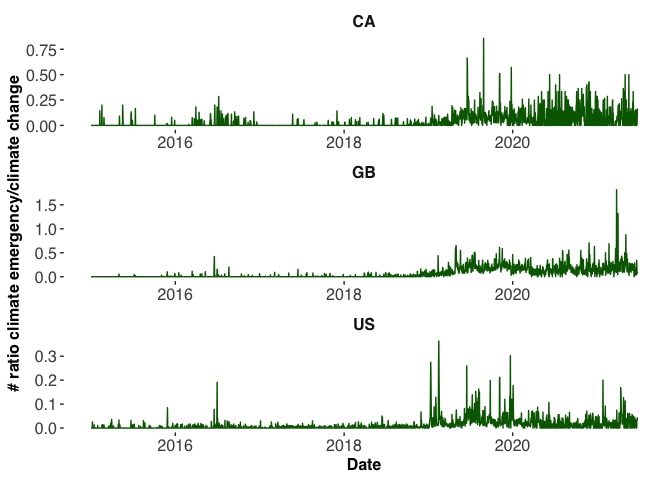

# Tweet Counts Demo

We will be using the following packages:


```r
library(academictwitteR) #to query the Twitter API
library(ggplot2) #for plotting
library(dplyr) #for data wrangling
library(ggthemes) #for plot styiling
library(tidyr) #for data wrangling
```


## Querying the API


```r
# main function -----------------------------------------------------------

queries <- c(rep("(climate emergency)", 3), rep("(climate change)", 3))

countries <- c(rep(c("GB", "US", "CA"), 2))

tcs_all <- data.frame()

for (i in seq_along(queries)) {
  
  ctquery = queries[[i]]
  ctcountry = countries[[i]]
  
  tcs <- count_all_tweets(
    query = ctquery,
    start_tweets = "2019-01-01T00:00:00Z",
    end_tweets = "2021-06-25T00:00:00Z",
    granularity = "day",
    country = ctcountry,
    n = Inf
  )
  
  tcs <- tcs %>%
    mutate(date = as.Date(start),
           query = ctquery,
           country = ctcountry) %>%
    select(query, date, tweet_count, country)
  
  tcs_all <- rbind(tcs_all, tcs)
}
```

If you want to follow along without actually querying the API to collect the data, you can get the data from my Github here by using:


```r
tweetcounts  <- readRDS(gzcon(url("https://github.com/cjbarrie/twitter_twitch2/blob/main/data/clim_emergency.rds?raw=true")))
```

## Inspect the data

And this what these data look like:


|query               |date       | tweet_count|country |
|:-------------------|:----------|-----------:|:-------|
|(climate emergency) |2021-05-25 |           2|GB      |
|(climate emergency) |2021-05-26 |          10|GB      |
|(climate emergency) |2021-05-27 |           4|GB      |
|(climate emergency) |2021-05-28 |           2|GB      |
|(climate emergency) |2021-05-29 |           3|GB      |
|(climate emergency) |2021-05-30 |           4|GB      |

```
## 'data.frame':	14202 obs. of  4 variables:
##  $ query      : chr  "(climate emergency)" "(climate emergency)" "(climate emergency)" "(climate emergency)" ...
##  $ date       : Date, format: "2021-05-25" "2021-05-26" ...
##  $ tweet_count: int  2 10 4 2 3 4 4 4 6 5 ...
##  $ country    : chr  "GB" "GB" "GB" "GB" ...
```

## Plot

We can plot as facets like this:


```r
tcs_all %>%
  ggplot(aes(date, tweet_count, group = query, color=query)) +
  geom_line() +
  theme_tufte(base_family = "Helvetica") +
  labs(x = "Date", y = "# tweets") +
  facet_wrap(~ country, scales = "free", nrow = 3) +
  theme(legend.position = "bottom",
        legend.direction = "horizontal",
        strip.text = element_text(size=12, face = "bold"),
        axis.title = element_text(size = 12, face = "bold"),
        axis.text = element_text(size = 12))
```

<!-- -->

But the climate emergency counts are quite difficult to see. Log them to make the relative differences easier to visually inspect:


```r
tcs_all %>%
  ggplot(aes(date, log(tweet_count), group = query, color=query)) +
  geom_line() +
  theme_tufte(base_family = "Helvetica") +
  labs(x = "Date", y = "# tweets (logged)") +
  facet_wrap(~ country, scales = "free", nrow = 3) +
  theme(legend.position = "bottom",
        legend.direction = "horizontal",
        strip.text = element_text(size=12, face = "bold"),
        axis.title = element_text(size = 12, face = "bold"),
        axis.text = element_text(size = 12))
```

<!-- -->

Or just use a ratio as before. To do this, we first need to reshape the data so that we have columns of counts for each of the queries. 

Then we can plot as such:


```r
## reshape long to wide and plot

tcs_all %>%
  pivot_wider(names_from = query,
              values_from = tweet_count) %>%
  mutate(ratio = `(climate emergency)` / `(climate change)`) %>%
  ggplot(aes(date, ratio)) +
  geom_line(color = "darkgreen") +
  theme_tufte(base_family = "Helvetica") +
  labs(x = "Date", y = "# ratio climate emergency/climate change") +
  facet_wrap(~ country, scales = "free", nrow= 3) +
  theme(legend.position = "bottom",
        legend.direction = "horizontal",
        strip.text = element_text(size=12, face = "bold"),
        axis.title = element_text(size = 12, face = "bold"),
        axis.text = element_text(size = 12))
```

<!-- -->
